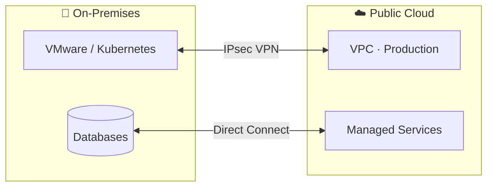

# 🌐 Hybrid Cloud — The Complete, No-Boring Guide


> [!TIP]
> **TL;DR** — Hybrid cloud = your on-premises data center + one or more public clouds, wired together so workloads move freely. Keep sensitive stuff close, burst to the cloud when you need scale. Best of both worlds — *if* you design the network right.


## 1. What "hybrid" actually means

Forget the marketing slides. Hybrid cloud is simply this: **two (or more) environments that behave like one**. Your apps don't care whether they run on a rack in Jakarta or in an AWS region in Singapore — the network, identity, and tooling make it feel like a single platform.

Think of it like a house with a home office: you do focused work at home (on-prem: control, low latency, compliance), but when you throw a party for 200 people, you rent the venue next door (public cloud: elastic scale). Same life, different rooms.

## 2. Public vs Private vs Hybrid

| | 🌍 Public Cloud | 🏢 Private Cloud | 🌐 Hybrid Cloud |
|---|---|---|---|
| **Where it runs** | Provider's data centers | Your data center | Both, connected |
| **Scaling** | Near-infinite, on demand | Limited by hardware you own | Burst to cloud when needed |
| **Cost model** | Pay-as-you-go (OpEx) | Upfront hardware (CapEx) | Mix — optimize per workload |
| **Control** | Shared responsibility | Full control | Full control where it matters |
| **Best for** | Startups, spiky traffic | Regulated data, steady loads | Everyone in between |

## 3. How the two worlds connect

### Option A — IPsec VPN (the quick way)

Encrypted tunnel over the public internet. Cheap, set up in an afternoon, ~1 Gbps. Perfect for dev environments, backups, and "let's try hybrid this sprint."

### Option B — Dedicated interconnect (the serious way)

Private fiber straight into the cloud provider: **AWS Direct Connect**, **Azure ExpressRoute**, **Google Cloud Interconnect**. Consistent latency, up to 100 Gbps, no internet in the path. This is what production hybrid runs on.

| | IPsec VPN | Dedicated Interconnect |
|---|---|---|
| Bandwidth | Up to ~1.25 Gbps per tunnel | 1–100 Gbps |
| Latency | Varies (internet) | Consistent & low |
| Setup time | Hours | Weeks (physical circuit) |
| Cost | Pennies | Real money |

**Try it yourself** — `vpn.tf` spins up an AWS Site-to-Site VPN in ~30 lines of Terraform:

```hcl
resource "aws_vpn_connection" "hybrid" {
  vpn_gateway_id      = aws_vpn_gateway.this.id
  customer_gateway_id = aws_customer_gateway.datacenter.id
  type                = "ipsec.1"
  static_routes_only  = true
  tags                = { Name = "hybrid-tunnel" }
}
```

## 4. The 3 hybrid patterns you'll meet in interviews

1. **☁️ Cloud bursting** — Base load runs on-prem; traffic spikes overflow to the cloud. E-commerce on 11.11, tax season, ticket launches.
2. **💾 Backup & disaster recovery** — On-prem stays primary; the cloud holds replicas and takes over if the data center goes dark. Cheap insurance.
3. **🧲 Data gravity** — Keep heavy data where it lives (on-prem databases, edge devices) and push only compute or analytics to the cloud.



## 5. When hybrid wins — and when it doesn't

✅ **Go hybrid when:** you have compliance rules pinning data on-prem, steady baseline load with wild spikes, or existing hardware you can't just throw away.

❌ **Skip it when:** you're cloud-native from day one, your team is tiny (one environment is enough complexity), or your "hybrid" is really just two disconnected silos with a VPN nobody monitors.

> [!WARNING]
> The #1 hybrid anti-pattern: connecting the networks but not the **identity, monitoring, and deployment pipelines**. Two dashboards, two logins, two ways to deploy = twice the pain, zero benefit.

## 6. 🎯 5-minute quiz

**Q1.** What's the main difference between a hybrid cloud and simply "using AWS + having a data center"?
<details><summary>Answer</summary>Integration. Hybrid means the environments are connected and workloads can move between them (shared network, identity, tooling). Two disconnected silos are just... two silos.</details>

**Q2.** Your traffic spikes 10x every Friday night but is flat the rest of the week. Which hybrid pattern fits?
<details><summary>Answer</summary>Cloud bursting — run the flat baseline on-prem, overflow the Friday spike to the cloud.</details>

**Q3.** Name the dedicated interconnect services of AWS, Azure, and GCP.
<details><summary>Answer</summary>AWS Direct Connect, Azure ExpressRoute, Google Cloud Interconnect (Dedicated/Partner).</details>

**Q4.** Why might a bank keep its core ledger on-prem while running its mobile app backend in the cloud?
<details><summary>Answer</summary>Compliance and data gravity — regulators may require the ledger to stay in controlled infrastructure, while the mobile backend benefits from cloud elasticity.</details>

**Q5.** True or false: a VPN tunnel alone makes your setup "hybrid cloud."
<details><summary>Answer</summary>False — the tunnel is just plumbing. Hybrid needs unified identity, monitoring, and deployment across both sides.</details>

## 7. 🎬 Watch & go deeper

| | |
|---|---|
| [](https://www.youtube.com/watch?v=vBJjC_Eg9_Q) | [](https://www.youtube.com/watch?v=3kGFBBy3Lyg) |
| [▶ Hybrid Cloud Explained](https://www.youtube.com/watch?v=vBJjC_Eg9_Q) | [▶ Hybrid Cloud Basics](https://www.youtube.com/watch?v=3kGFBBy3Lyg) |

**Docs worth bookmarking:**
- [Google Cloud — What is hybrid cloud?](https://cloud.google.com/learn/what-is-hybrid-cloud)
- [Azure Cloud Adoption Framework — Hybrid scenario](https://learn.microsoft.com/en-us/azure/cloud-adoption-framework/scenarios/hybrid/)

---

*Originally Day 01 of [#cloud-daily](https://github.com/sepkascurty-cpu/cloud-daily) — now a standalone guide.* ☁️
